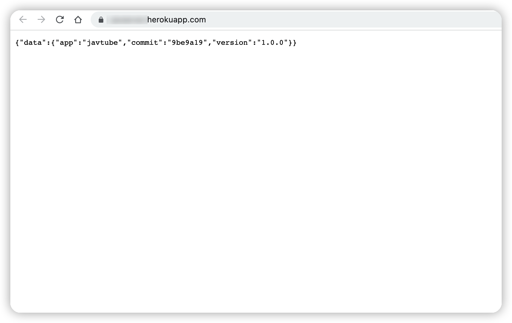
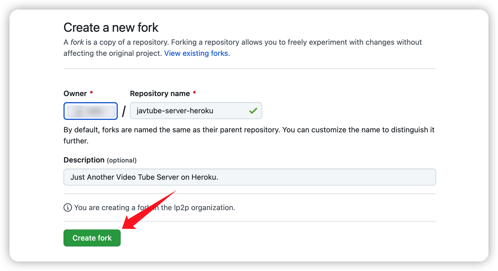
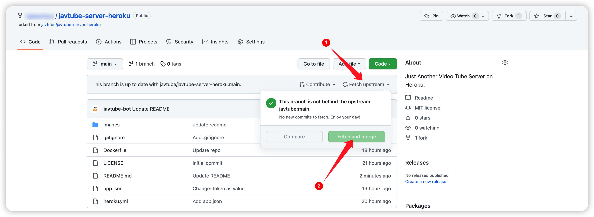
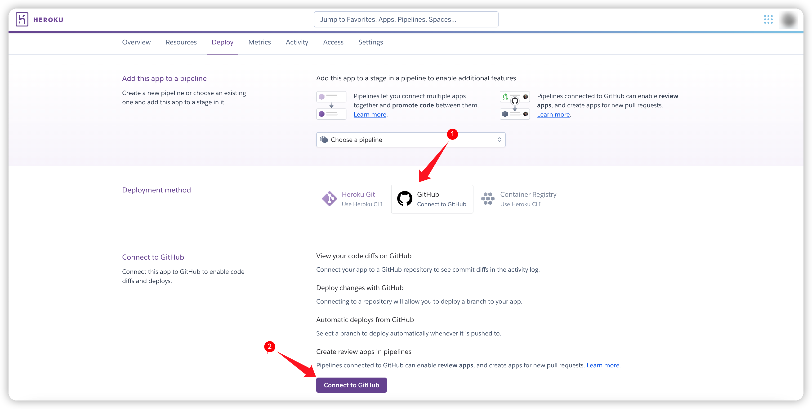
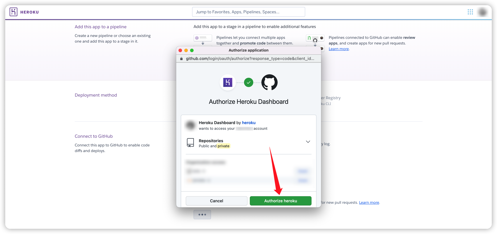
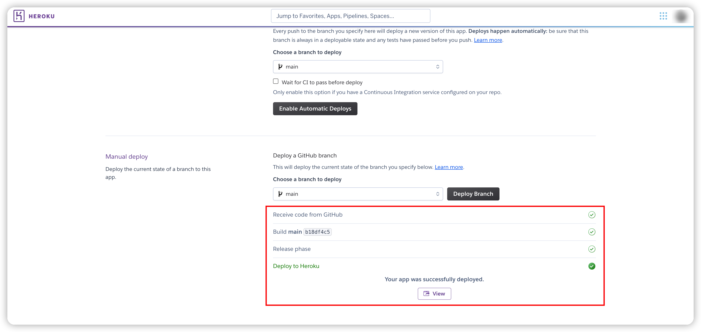
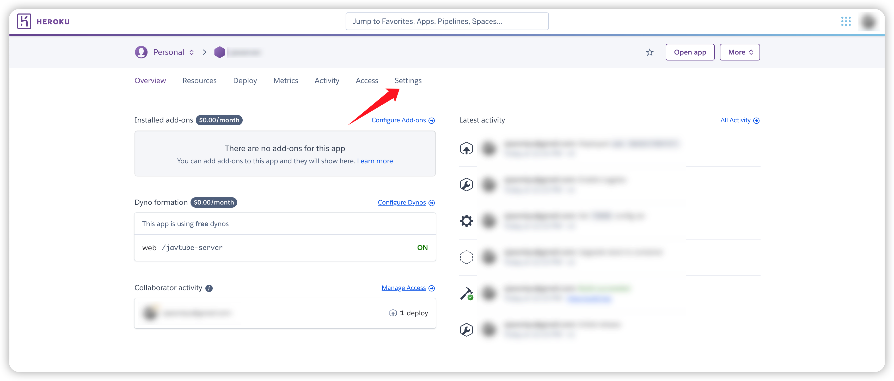
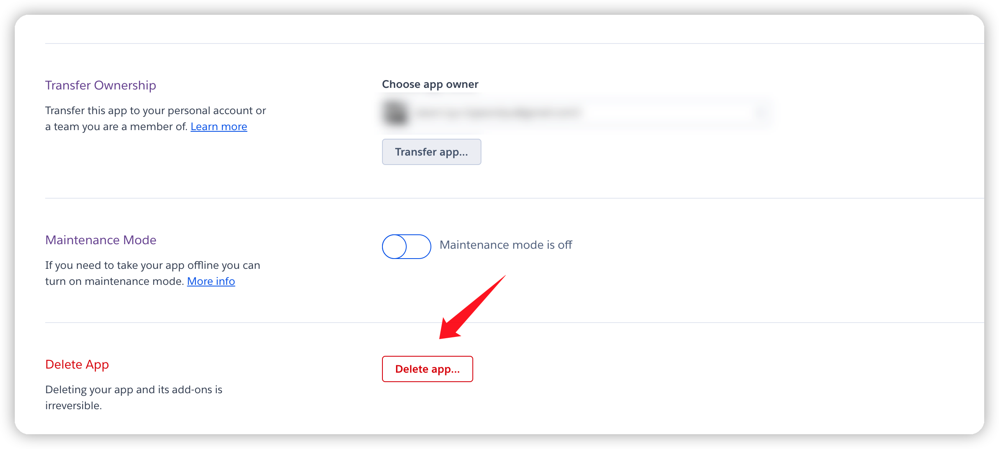

# 部署到 Heroku

## ‼️置顶

> **Heroku Update**
>
>Starting November 28th, 2022, free Heroku Dynos, free Heroku Postgres, and free Heroku Data for Redis® will no longer be available.
If you have apps using any of these resources, you must upgrade to paid plans by this date to ensure your apps continue to run and to retain your data. For students, we will announce a new program by the end of September.

Heroku不再免费，请使用Docker部署后端，或使用[Koyeb快速部署](../koyeb/README.md)。

## 项目介绍

> - 部分新建的应用有可能需要科学访问，如果需要可以套一层Cloudflare CDN或Workers。
> - Heroku对免费账号存在如内存、冷启动等限制，但是对于个人部署使用MetaTube后端项目理论上是足够的，具体可以参考[Pricing](https://www.heroku.com/pricing)。

使用本仓库可以快速将`MetaTube`后端~~免费~~部署至[`Heroku`](https://heroku.com)云平台。

## 一键部署

## 具体说明

> 以下步骤需要登录Heroku账号，没有账号的可以先进行[注册](https://signup.heroku.com/)。

### 部署应用

- 点击本页面中的[一键部署](#一键部署)按钮创建app。

- 在`App name`中输入自定义的应用名。
- **建议**将地区选择为`United States`。
- 在`Config Vars`中输入新的`TOKEN`并**复制**。
- 点击`Deploy app`完成部署。

- 右键**复制**View中的`MetaTube Server URL`链接地址。

- 可以点击View，出现类似如下的页面即为部署成功。

- 在MetaTube插件中分别粘贴进之前复制的`MetaTube Server URL`与`TOKEN`以完成插件配置。

### 更新应用

> 本节仅当有更新需求时参考。

- 点击本仓库右上方的`Fork`按钮。

- 点击`Create fork`。

- 如果**之前已经Fork过**本仓库，则选择`Fetch upstream -> Fetch and merge`，**否则跳过此步骤**。

> 建议每次在更新后端之前，都尝试`Fetch and merge`以与源仓库保持同步。

- 然后进入[Heroku Dashboard](https://dashboard.heroku.com/apps)，选择之前部署的应用。

- 在Dashboard中，选择`Deploy`。

- 在`Deploy`中，选择`GitHub`并点击`Connect to GitHub`。

- 在弹出的页面中，点击`Authorize Heroku`。

- 按如下步骤连接之前Fork的仓库。

- 点击`Deploy Branch`，即可完成更新。

> 后续更新后端也只需要点击`Deploy Branch`即可。

- 如下图所示，即表示已完成更新。

> PS：当然也可以直接通过**删除**并**重新创建**应用来进行更新，但是注意`app name`和`token`需要和之前保持一致。

### 删除应用

> ⚠本节会删除之前部署的应用导致后续刮削请求失败。除非有明确需求（例如重新部署应用），否则请略过。

- 进入[Heroku Dashboard](https://dashboard.heroku.com/apps)，点击需要删除的应用。

- 点击设置`Settings`。

- 拉到设置最底部，点击`Delete app`。

- 按提示，重新输入一遍应用名以删除应用。

